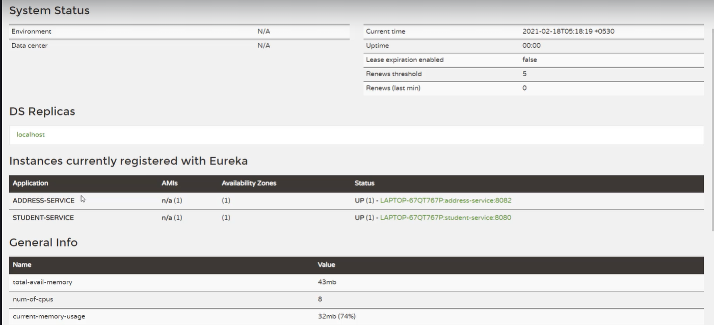

# 🎓 University Student Microservice System

  
  
  
  
  

---

## 🔹 Project Overview

This project demonstrates a **microservices architecture** using Spring Boot with the following components:

1. **University Student Microservice**  
   - Manages student information: name, age, email, enrollment details.  
   - Exposes REST endpoints for CRUD operations.

2. **Address Microservice**  
   - Handles student addresses (city, state, country, postal code).  
   - Integrates with **Student Microservice** via **OpenFeign** and **WebClient**.

3. **Database**  
   - Each microservice uses **PostgreSQL** for persistent storage.  

---

## ⚡ Features

* ✅ Spring Boot Microservices
* ✅ Inter-service communication using OpenFeign & WebClient
* ✅ PostgreSQL integration for persistent storage
* ✅ CRUD APIs for Student and Address
* ✅ Exception Handling & Validation

---

## 🚀 Tech Stack

| Component     | Technology           |
| ------------- | -------------------- |
| Framework     | Spring Boot 3.3.x    |
| Service Calls | OpenFeign, WebClient |
| Database      | PostgreSQL           |
| Build Tool    | Maven                |
| Java Version  | 17+                  |
| API Testing   | Postman / Swagger    |

---

## Eureka Server



Eureka Server is a REST-based service registry used in microservices architectures to enable service discovery. It acts as a naming server where client services register themselves and query for other services to discover their network locations dynamically.

### Key Features

- **Service Registration:** Client microservices register with the Eureka Server upon startup.
- **Service Discovery:** Clients query the Eureka Server to find instances of other services.
- **Health Checks:** Eureka monitors registered services and removes unavailable instances for fault tolerance.
- **Load Balancing Integration:** Works seamlessly with Netflix Ribbon, Spring Cloud LoadBalancer, etc.
- **Highly Available:** Can be run in a cluster of servers for redundancy.

### How it Works

1. **Service Registration:** Services send heartbeats to Eureka to maintain their presence.
2. **Discovery Client:** When calling a dependent service, clients query Eureka to get the currently available instances.
3. **Fault Tolerance:** Eureka removes instances that fail to send heartbeats and updates the clients accordingly.

### Typical Use Case

- In a microservices setup, each service registers with Eureka Server.
- Load balancers and API gateways rely on Eureka to route requests to live services dynamically instead of hardcoding URLs.

---

---

## 🌐 API Gateway and Spring Cloud Load Balancer


 **API Gateway** is used in this project as a single entry point for all client requests to the microservices. It simplifies communication, enhances security, and provides cross-cutting features.

### 🔑 Key Features
- **Single Entry Point**: Clients interact with one endpoint instead of multiple microservices.  
- **Request Routing**: Forwards requests to the appropriate microservice (Student Service, Address Service, etc.).  
- **Load Balancing**: Works with Spring Cloud LoadBalancer to distribute traffic.  
- **Cross-Cutting Concerns**: Centralized handling of security, logging, monitoring, and rate limiting.  
- **Path-Based Routing**: Routes requests based on the request path.  

## ⚖️ Spring Cloud LoadBalancer

Spring Cloud LoadBalancer is used in this project to distribute requests between instances of microservices, ensuring **scalability, reliability, and fault tolerance**.

### 🔑 Key Points
- **Client-Side Load Balancing**: The service consumer decides which service instance to call.  
- **Dynamic Service Discovery**: Works seamlessly with service registries like Eureka or static configuration.  
- **Integration with OpenFeign & WebClient**: Feign clients and WebClient can automatically use LoadBalancer to resolve service names.  
- **Round-Robin by Default**: Requests are distributed evenly across available instances.  


-------


### ⚙️ Example Configuration (Spring Cloud Gateway)
```yaml
spring:
  cloud:
    gateway:
      routes:
        - id: student-service
          uri: lb://student-service
          predicates:
            - Path=/students/**
        - id: address-service
          uri: lb://address-service
          predicates:
            - Path=/addresses/**

---


To see the full implementation, clone the repository and check the service registration and discovery configuration.


## 📦 Setup & Run

### 1. Clone Repository


```bash
git clone https://github.com/sangeetha2402-ravichandran/SpringBoot-Microservices-App.git

---


 🏗 Architecture Diagram


+----------------+         +----------------+
| Student Service| <-----> | Address Service|
+----------------+         +----------------+
        |                         |
        v                         v
   PostgreSQL DB               PostgreSQL DB


